## Project: Perception Pick & Place

# Required Steps for a Passing Submission:
1. Extract features and train an SVM model on new objects (see `pick_list_*.yaml` in `/pr2_robot/config/` for the list of models you'll be trying to identify).
2. Write a ROS node and subscribe to `/pr2/world/points` topic. This topic contains noisy point cloud data that you must work with.
3. Use filtering and RANSAC plane fitting to isolate the objects of interest from the rest of the scene.
4. Apply Euclidean clustering to create separate clusters for individual items.
5. Perform object recognition on these objects and assign them labels (markers in RViz).
6. Calculate the centroid (average in x, y and z) of the set of points belonging to that each object.
7. Create ROS messages containing the details of each object (name, pick_pose, etc.) and write these messages out to `.yaml` files, one for each of the 3 scenarios (`test1-3.world` in `/pr2_robot/worlds/`).  [See the example `output.yaml` for details on what the output should look like.](https://github.com/udacity/RoboND-Perception-Project/blob/master/pr2_robot/config/output.yaml)  
8. Submit a link to your GitHub repo for the project or the Python code for your perception pipeline and your output `.yaml` files (3 `.yaml` files, one for each test world).  You must have correctly identified 100% of objects from `pick_list_1.yaml` for `test1.world`, 80% of items from `pick_list_2.yaml` for `test2.world` and 75% of items from `pick_list_3.yaml` in `test3.world`.
9. Congratulations!  Your Done!

## [Rubric](https://review.udacity.com/#!/rubrics/1067/view) Points
### Here I will consider the rubric points individually and describe how I addressed each point in my implementation.  

---
### Writeup / README

#### 1. Provide a Writeup / README that includes all the rubric points and how you addressed each one.  You can submit your writeup as markdown or pdf.  

You're reading it!

### Exercise 1, 2 and 3 pipeline implemented
#### 1. Complete Exercise 1 steps. Pipeline for filtering and RANSAC plane fitting implemented.
The initial steps in the perception pipeline are focused on filtering the point cloud data obtained from the RGB-D camera. First, a filter is used to remove noise from the data. This was done use a filter that performed statistical analysis on the point compared to neighboring points to find and remove outliers from the data, resulting in a more accurate, clearer point cloud.

    # TODO: Statistical Outlier Filtering
    outlier_filter = cloud.make_statistical_outlier_filter()

    # Set the number of neighboring points to analyze for any given point
    outlier_filter.set_mean_k(50)

    # Set threshold scale factor
    x = 0.02

    # Any point with a mean distance larger than global (mean distance+x*std_dev) will be considered outlier
    outlier_filter.set_std_dev_mul_thresh(x)

    # Finally call the filter function for magic
    cloud_stat_filtered = outlier_filter.filter()

Before this filter:
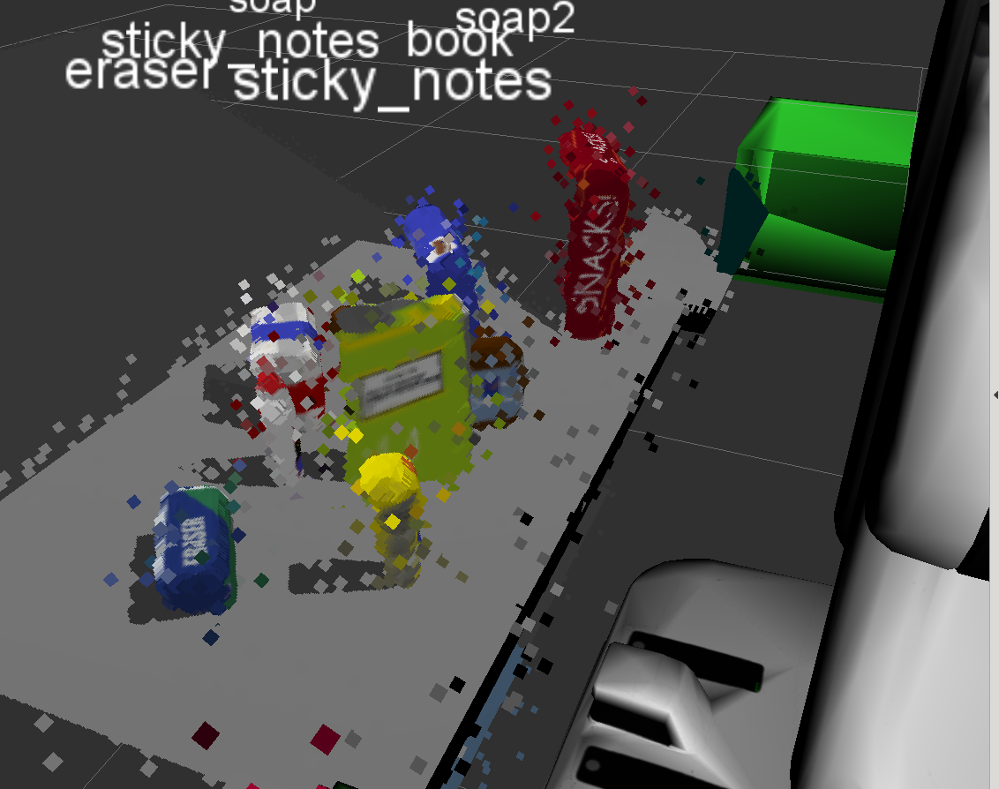
After this filter:
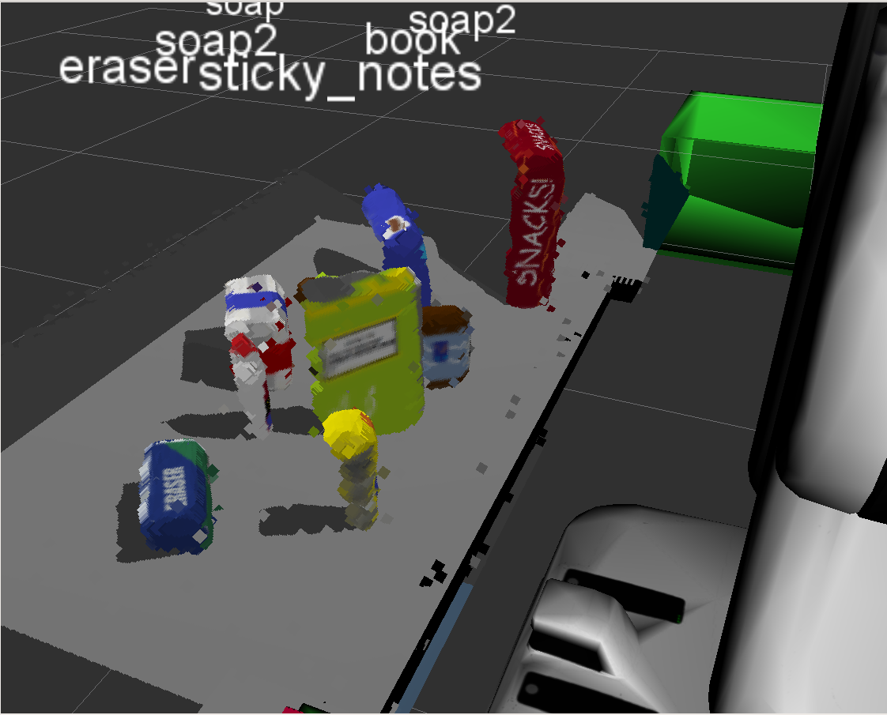

The resulting point cloud was downsampled to a lower resolution to reduce computational load using a voxel grid filter. This filter must be tuned to retain enough detail for the desired image processing tasks. I have the leaf size set relatively high due to computational constraints which may contribute to misclassification later on in the pipeline.

      # TODO: Voxel Grid Downsampling
      # Create a VoxelGrid filter object for our input point cloud
      vox = cloud_stat_filtered.make_voxel_grid_filter()
      # Choose a voxel (also known as leaf) size
      # Experiment and find the appropriate size!
      LEAF_SIZE = 0.01

      # Set the voxel (or leaf) size
      vox.set_leaf_size(LEAF_SIZE, LEAF_SIZE, LEAF_SIZE)

      # Call the filter function to obtain the resultant downsampled point cloud
      cloud_vox_filtered = vox.filter()

After Voxel Downsampling:
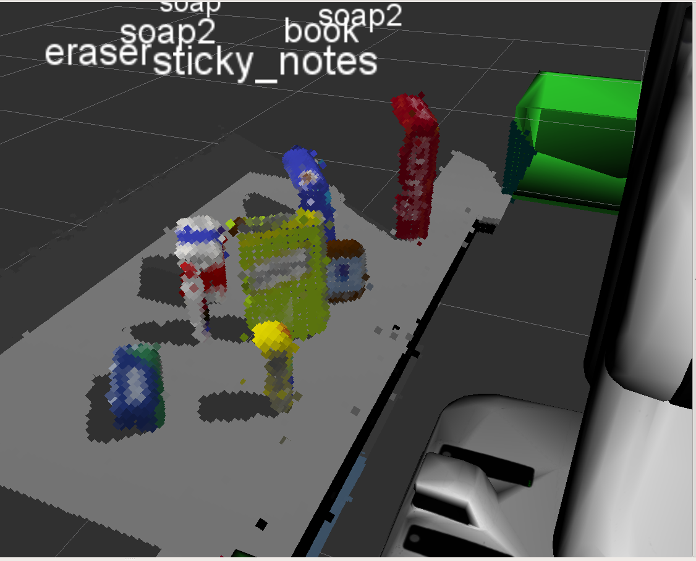

Next, two passthrough filters were implemented. These were used to limit the point cloud to a known area of interest within the scene the robot is observing. In this case, one along the z axis to reduce the point cloud to the space containing the table tops and above. Then one along the y axis to reduce it to just the table in front of the robot, eliminating readings from the pick boxes in the peripheral areas of detection. Notic in the image the floor and areas of the side table are now removed.

    # TODO: PassThrough Filter
      # Create a PassThrough filter object.
      passthrough_z = cloud_vox_filtered.make_passthrough_filter()

      # Assign axis and range to the passthrough filter object.
      filter_axis = 'z'
      passthrough_z.set_filter_field_name(filter_axis)
      axis_min = 0.5
      axis_max = 1.1
      passthrough_z.set_filter_limits(axis_min, axis_max)

      # Finally use the filter function to obtain the resultant point cloud.
      cloud_pass_z_filtered = passthrough_z.filter()

      #Added additional passthough filter in x direction to filter out edges of pick bins
      # Create a PassThrough filter object.
      passthrough_y = cloud_pass_z_filtered.make_passthrough_filter()

      # Assign axis and range to the passthrough filter object.
      filter_axis = 'y'
      passthrough_y.set_filter_field_name(filter_axis)
      axis_min = -0.5
      axis_max = 0.5
      passthrough_y.set_filter_limits(axis_min, axis_max)

      # Finally use the filter function to obtain the resultant point cloud.
      cloud_pass_y_filtered = passthrough_y.filter()

After passthrough filters:
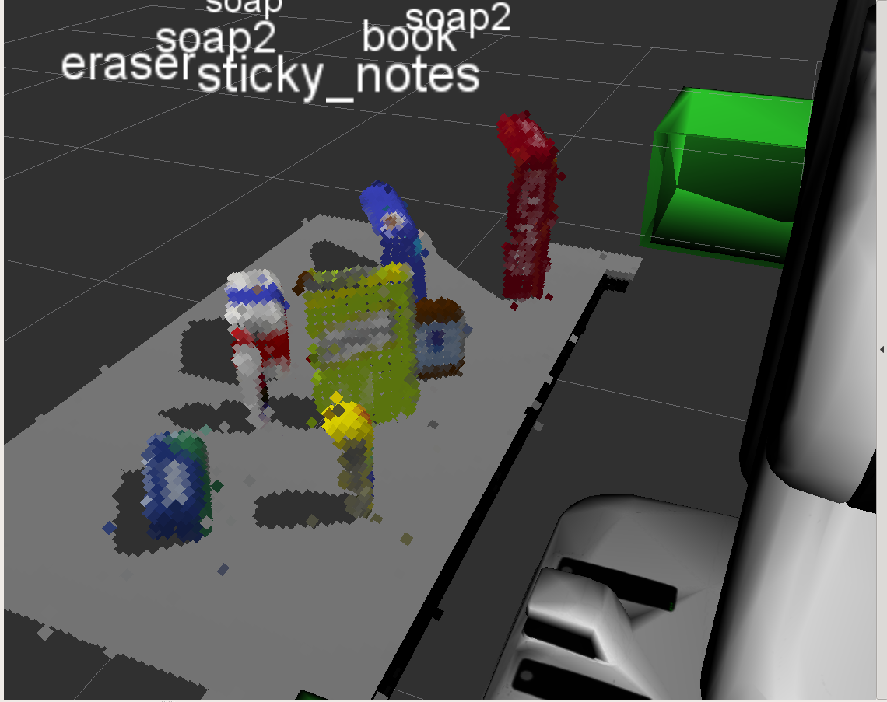

Now that the data has been reduced to a particular space, we need to be able to filter out the table top to enable the next steps in perception. This is accomplished by using a algorithm to filter out the plane that makes up the table. In this case, a Random Sample Consensus model is used to determine which points fit into the model of a plane and which do not. Those that fit are considered part of the table and removed from the pipeline for further processing. Those points that did not fit the model are objects on the table and are passed to the segmentation processing.

    # TODO: RANSAC Plane Segmentation
      # Create the segmentation object
      seg = cloud_pass_y_filtered.make_segmenter()

      # Set the model you wish to fit
      seg.set_model_type(pcl.SACMODEL_PLANE)
      seg.set_method_type(pcl.SAC_RANSAC)

      # Max distance for a point to be considered fitting the model
      # Experiment with different values for max_distance
      # for segmenting the table
      max_distance = 0.03
      seg.set_distance_threshold(max_distance)

      # Call the segment function to obtain set of inlier indices and model coefficients
      inliers, coefficients = seg.segment()

      # TODO: Extract inliers and outliers
      # Extract inliers, or points designated to table to a new point cloud
      cloud_table = cloud_pass_y_filtered.extract(inliers, negative=False)

      # Extract outliers, or points that make up the objects on the table
      cloud_objects = cloud_pass_y_filtered.extract(inliers, negative=True)

Point Cloud data that fit table model:
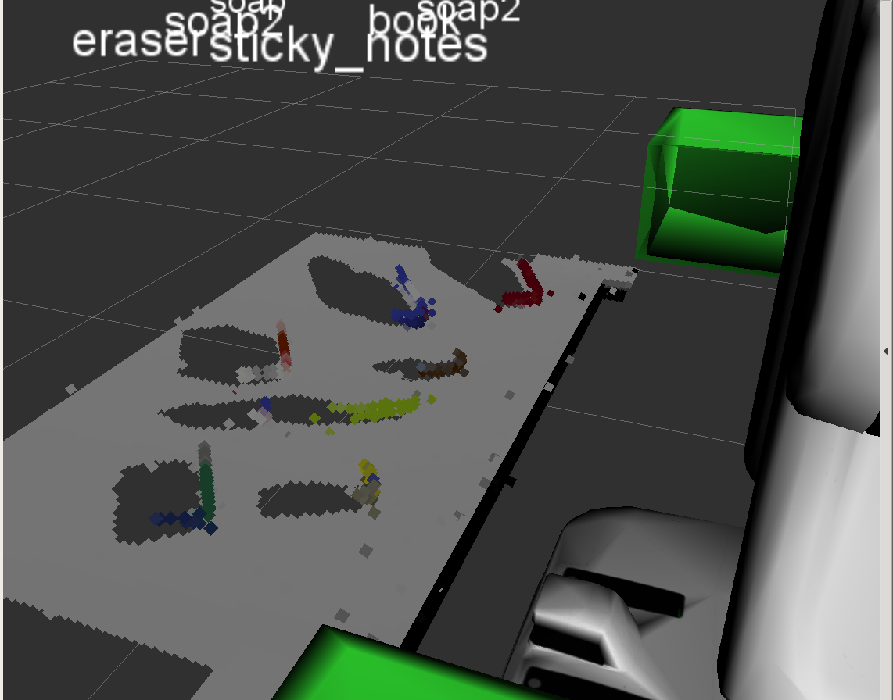
Point cloud data that didn't fit the model:
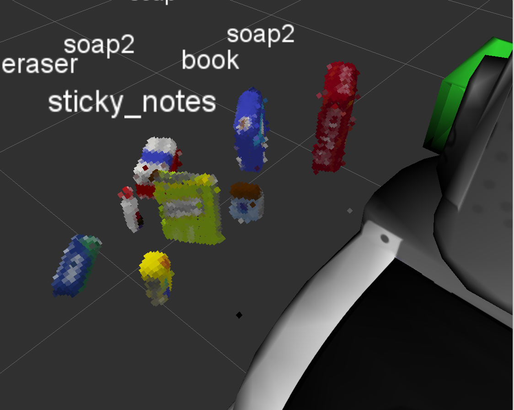

#### 2. Complete Exercise 2 steps: Pipeline including clustering for segmentation implemented.  
Now that the point cloud has been sufficiently filtered down to the items of interest, the focus shifts to what points make up which object. This is accomplished using an Euclidiean clustering algorithm. Through experimental testing, the algorithm is tuned to cluster the points into separate groups that correspond to each individual object in the scene. These clusters are further processed to be shown in different colors to help verify accuracy of this process.

       #TODO: Euclidean Clustering
       # Euclidean Clustering
       white_cloud = XYZRGB_to_XYZ(cloud_objects)# Apply function to convert XYZRGB to XYZ
       tree = white_cloud.make_kdtree()

       # Create a cluster extraction object
       ec = white_cloud.make_EuclideanClusterExtraction()
       # Set tolerances for distance threshold
       # as well as minimum and maximum cluster size (in points)
       ec.set_ClusterTolerance(0.05)
       ec.set_MinClusterSize(20)
       ec.set_MaxClusterSize(3000)
       # Search the k-d tree for clusters
       ec.set_SearchMethod(tree)
       # Extract indices for each of the discovered clusters
       cluster_indices = ec.Extract()

       # TODO: Create Cluster-Mask Point Cloud to visualize each cluster separately
       #Assign a color corresponding to each segmented object in scene
       cluster_color = get_color_list(len(cluster_indices))

       color_cluster_point_list = []

       for j, indices in enumerate(cluster_indices):
           for i, indice in enumerate(indices):
               color_cluster_point_list.append([white_cloud[indice][0],
                                               white_cloud[indice][1],
                                               white_cloud[indice][2],
                                                rgb_to_float(cluster_color[j])])

       #Create new cloud containing all clusters, each with unique color
       cluster_cloud = pcl.PointCloud_PointXYZRGB(color_cluster_point_list)
       cluster_cloud.from_list(color_cluster_point_list)

Clustered Point Clouds:
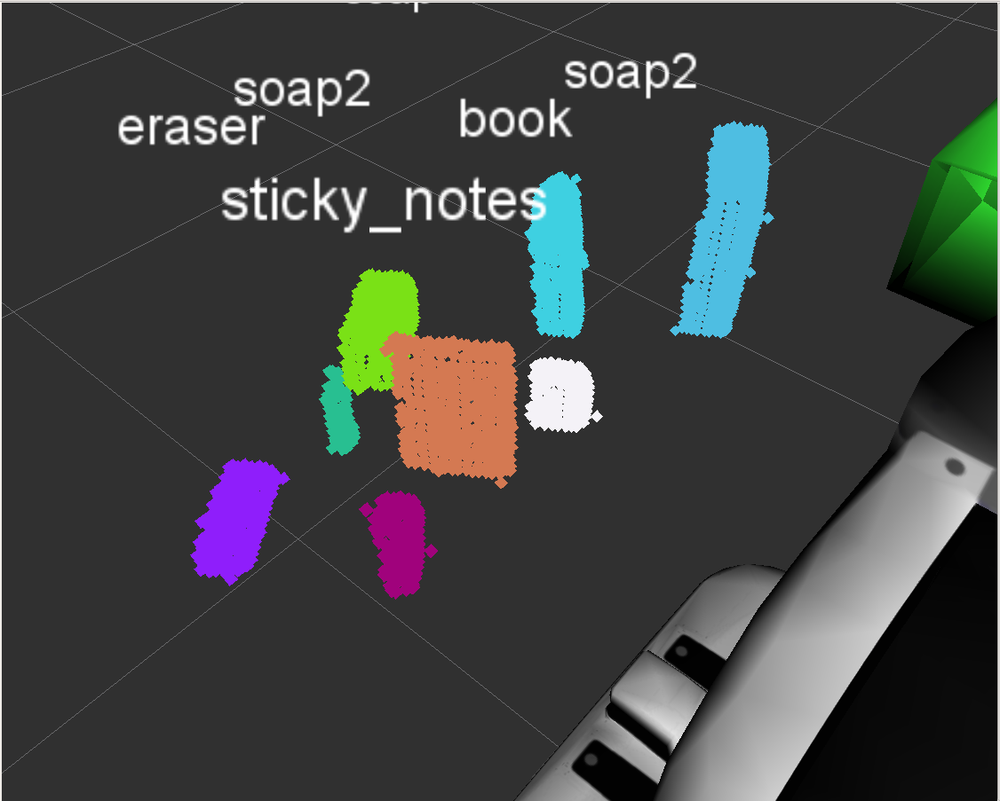

#### 2. Complete Exercise 3 Steps.  Features extracted and SVM trained.  Object recognition implemented.
After verifying that we have the expected clusters, we move on to object recognition. This is accomplished by comparing features in the individual clusters to features in objects from a known dataset. These features include color histograms and surface normals. In order to match the features detected in a certain cluster to our known list of objects, a Support Vector Classifier(SVC) was trained using provided scripts. Data to feed the SVC was captured using a program based on capture_features.py to compute features based on 300 sample point clouds of each object. The feature vectors were then utilized by train_svm.py to build a model to classify a point cloud based on these feature vectors. In our perception pipeline, we use the same method of feature extraction then call our classifier to determine the best fit for the point cloud.

      # Classify the clusters! (loop through each detected cluster one at a time)
      detected_objects_labels = []
      detected_objects = []

          # Grab the points for the cluster
      for index, pts_list in enumerate(cluster_indices):
          # Grab the points for the cluster from the extracted outliers (cloud_objects)
          pcl_cluster = cloud_objects.extract(pts_list)
          # TODO: convert the cluster from pcl to ROS using helper function
          ros_cluster = pcl_to_ros(pcl_cluster)
          # Extract histogram features
          # TODO: complete this step just as is covered in capture_features.py
          # Compute the associated feature vector
          chists = compute_color_histograms(ros_cluster, using_hsv=True)
          normals = get_normals(ros_cluster)
          nhists = compute_normal_histograms(normals)
          feature = np.concatenate((chists, nhists))
          # Make the prediction, retrieve the label for the result
          # and add it to detected_objects_labels list
          prediction = clf.predict(scaler.transform(feature.reshape(1,-1)))
          label = encoder.inverse_transform(prediction)[0]
          detected_objects_labels.append(label)
          # Publish a label into RViz
          label_pos = list(white_cloud[pts_list[0]])
          label_pos[2] += .4
          object_markers_pub.publish(make_label(label,label_pos, index))

          # Add the detected object to the list of detected objects.
          do = DetectedObject()
          do.label = label
          do.cloud = ros_cluster
          detected_objects.append(do)

      rospy.loginfo('Detected {} objects: {}'.format(len(detected_objects_labels), detected_objects_labels))

The number of samples needed for accurate classification was determined by looking at the results of train_svm.py as displayed in the confusion matrix below. This matrix allows us to see how the model classifies known objects compared to the ground truth. If we look at the matrix on the left, we see ground trugh on the y axis and the predicted label on the x axis. The focus is on the diagonal squares highlighted in dark blue. These show a normalized value, or percentage, that the SVC correctly classified the particular object. Feature capture and SVC training were repeated on several different values from 50-300 to balance computational load and accuracy.

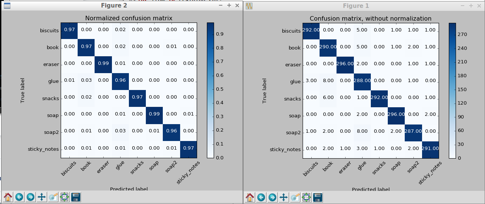

After passing through the perception pipeline, the following images show the results in the three different scenarios.
Here is an image of the perception pipeline working in test world 1: 3/3 items successfully recognized
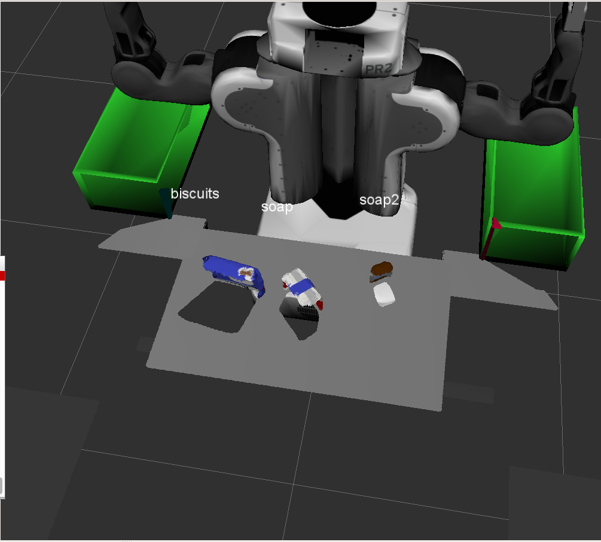
Test World 2 5/5 objects successfully recognized:
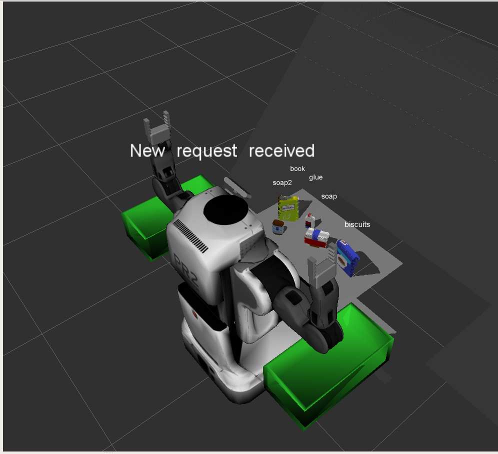
Test World 3 7/8 objects successfully recognized:
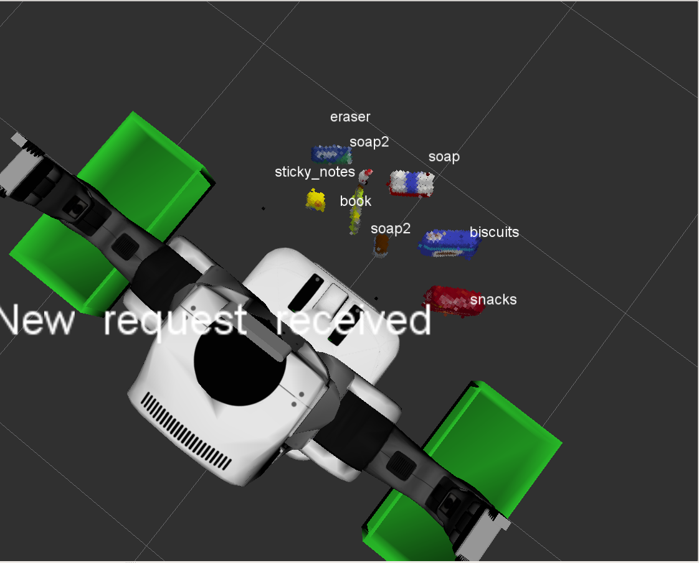

### Pick and Place Setup

#### 1. For all three tabletop setups (`test*.world`), perform object recognition, then read in respective pick list (`pick_list_*.yaml`). Next construct the messages that would comprise a valid `PickPlace` request output them to `.yaml` format.

After successfully recognizing the objects, we move on to analyzing what we need to perform a pick and place operation. The robot needs to know where each object on its pick list is, which arm to use, and where to place the object. These tasks are performed by the pr2_mover function and the output is provided in .yaml format.

After initializing the necessary variables and pulling in the pick list from the required parameters, we moved on to process each entry.  If the item on the pick list has been recognized, the centroid is computed from it's respective point cloud and passed as the pick position.

    # If the item from the pick list has been detected, compute its centroid
        #and pass store in pick_pose
        if object_name.data in labels:
            print('{0} detected, saving pick pose'.format(object_name.data))
            ind = labels.index(object_name.data)
            pick_pose.position.x = np.asscalar(centroids[ind][0])
            pick_pose.position.y = np.asscalar(centroids[ind][1])
            pick_pose.position.y = np.asscalar(centroids[ind][2])

Then, the required place position and arm to use is determined by looking at the object's group and passed as place_pose and arm_name, respectively.

    # TODO: Create 'place_pose' for the object
        dropbox_param = rospy.get_param('/dropbox')
        #Parse Dropbox parameters
        for dropbox in dropbox_param:
            dropbox_name = dropbox['name']
            dropbox_group = dropbox['group']
            dropbox_pos = dropbox['position']
            if dropbox_group == object_group:
                place_pose.position.x = dropbox_pos[0]
                place_pose.position.y = dropbox_pos[1]
                place_pose.position.z = dropbox_pos[2]

        # TODO: Assign the arm to be used for pick_place
        if object_group == 'green':
            arm_name.data = 'right'
        else:
            arm_name.data = 'left'
All the required information is then saved in a dictionary format

    # TODO: Create a list of dictionaries (made with make_yaml_dict()) for later output to yaml format
        yaml_dict = make_yaml_dict(test_scene_num, arm_name, object_name, pick_pose, place_pose)
        dict_list.append(yaml_dict)

and output to a .yaml file once each item in the list has been processed.
     # TODO: Output your request parameters into output yaml file
        send_to_yaml('output_{0}.yaml'.format(test_scene_num.data), dict_list)

After the exercises performed in the class, most of the perception pipeline was straight forward to implement in this new environment from a conceptual standpoint. Most time was spent capturing features and tuning parameters of the algorithms to get the desired results. While the perception pipeline accuracy is acceptable, it suffers from several errors. The filters used could be fine tuned even more, the selection of and training of the classification model could be reviewed and compared more broadly.The pipeline is also currently misclassifying the partially occluded bottle of glue in scenario 3. Work to address a required confidence in classification or other methods may be able to increase the robustness of the pipeline. Further work in this area would most likely be spent on the pick and place performance, as the actual motion control has not been implemented.
